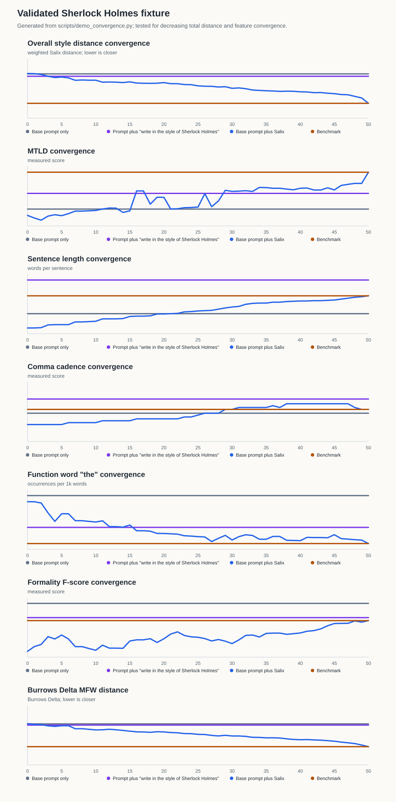

# Salix

Personal writing-style replicator. Captures an author's stylistic fingerprint
from prior writing samples, then iteratively rewrites target documents until
their measured linguistic features match.

Salix is packaged as an AI coding skill. The host model orchestrates the
edit loop; the Python scripts here do the measurement work.

## Quick start

### Claude app

1. Download `Salix.skill` from the latest GitHub release.
2. Open Claude.
3. Go to `Customize > Skills`.
4. Click `+`, choose `Upload a skill`, and select `Salix.skill`.
5. Toggle Salix on.

If Claude asks for a `.zip`, rename `Salix.skill` to `Salix.zip`; it is a ZIP
bundle with a Claude-friendly extension.

Then ask:

```text
Build my Salix profile.
```

### Claude Code or Codex

```bash
git clone https://github.com/thekozugroup/Salix.git
cd Salix
./install.sh --force
```

Restart or reload the agent, then ask: `Build my Salix profile.`

## Global and project styles

Use **global** style for your normal personal voice across projects:

```bash
./salix init --scope global
./salix ingest --name default --scope global
```

Use **project** style when a repo, client, publication, or persona needs its
own voice:

```bash
./salix init --scope project
cp docs/writing-samples/*.md .salix/samples/
./salix ingest --name client-a --scope project
```

`--scope auto` uses `.salix/` in the current project tree when it exists,
otherwise it uses `~/.salix`. Use `--scope install` only for legacy profiles
kept inside the Salix install folder. `SALIX_HOME=/custom/path` still works as
a legacy override.

## Side-by-side example

This is an illustrative product demo. Real output depends on the user's
benchmark, target draft, threshold, and whether the edit loop plateaus.

Prompt:

```text
Write a short Baker Street case note about a missing railway ticket.
```

| Base prompt only | Prompt plus "write in the style of Sherlock Holmes" | Base prompt plus Salix |
| --- | --- | --- |
| Holmes received a note about a missing railway ticket. He checked the details, compared the times, and realized the ticket had never been stolen. The answer was hidden in the passenger's route. | In the dim light of Baker Street, Holmes turned the railway ticket between his long fingers and gave one of those thin smiles which usually meant the matter had already resolved itself in his mind. The missing object, he said, was never truly missing at all. | To Sherlock Holmes the missing railway ticket was not a trifle, but a small fact misplaced among larger ones. I have seldom seen him regard so slight a paper with such cold attention, for in his eyes the little oblong of pasteboard eclipsed the whole confusion of the case. |

What changed: the middle column shows a direct style prompt. The Salix column
uses the base prompt plus a measured profile loop, so the comparison is against
the same benchmark features used in the convergence chart: sentence length,
punctuation cadence, hedging, paragraph rhythm, and sentence starters.

## Recursive convergence example

The chart below is generated from a checked-in fixture, not hand-entered demo
numbers. `scripts/demo_convergence.py` uses a public-domain excerpt from
[Project Gutenberg's The Adventures of Sherlock Holmes](https://www.gutenberg.org/ebooks/1661)
as the benchmark sample, analyzes at least 50 recursive Baker Street draft snapshots,
writes `examples/convergence_demo.json`, and renders the chart lines in
`examples/convergence_demo.svg`. The charts include measured lines for the
base prompt, direct style prompt, Salix, and the benchmark across every
technical scalar and distribution benchmark variable used by the distance
engine. The test
`test_demo_convergence_generates_validated_chart_lines` validates that the
demo shows at least 50 recursive edits, keeps going until Salix aligns with
the benchmark, and records the completed iteration plus chart count in the
JSON payload.



| Iteration | Total distance | Benchmark distance | Draft sentence length | Benchmark sentence length |
| --- | ---: | ---: | ---: | ---: |
| 0 | 2.0137 | 0.0000 | 5.4444 | 17.2222 |
| 10 | 1.5583 | 0.0000 | 7.8889 | 17.2222 |
| 20 | 1.3967 | 0.0000 | 10.5556 | 17.2222 |
| 30 | 1.0128 | 0.0000 | 13.1111 | 17.2222 |
| 40 | 0.7769 | 0.0000 | 15.3333 | 17.2222 |
| 50 | 0.0000 | 0.0000 | 17.2222 | 17.2222 |

Regenerate the validated demo artifacts:

```bash
python3 scripts/demo_convergence.py
```

Generate chart-ready JSON from your own draft:

```bash
./salix simulate draft.md --profile default --scope auto --json --pretty > convergence.json
python3 scripts/visualize.py convergence.json
```

## What gets measured

**Lexical & vocabulary richness**
- Type-token ratio, MTLD, mean word length, long-word ratio
- **Yule's K**, **Honoré's R**, **Simpson's D** — length-robust diversity measures

**Sentence shape**
- Mean & stdev of sentence length
- Length quantiles p25 / p50 / p75 / p90 (Mendenhall-style distribution shape)
- Short-sentence ratio, long-sentence ratio, comma-per-sentence rate

**Punctuation** — per-1000-word rates for `, ; : — - ( " ' ! ?` and ellipsis

**Topic-blind n-gram fingerprints**
- Function-word bigrams and trigrams (top-100 each, run-based extraction)
- **Character 3-grams and 4-grams** (top-200 each, cosine distance) — the
  highest-performing authorship feature in Stamatatos (2009)
- **Burrows' Delta** over the top-150 most-frequent function words — the
  Argamon topic-blind variant

**Readability** — Flesch–Kincaid grade, Gunning Fog, ARI

**Tone & stance**
- Hedging rate (with **contextual disambiguation** — "May 2024" and "could
  you" no longer count as hedges)
- Booster rate, discourse-marker rate
- **Heylighen–Dewaele formality F-score** (uses real spaCy POS counts when
  spaCy is installed; otherwise a deterministic suffix proxy)
- Passive-voice rate
- Sentiment polarity (~110-item AFINN-aligned lexicon)

**Paragraph shape** — mean sentences/words per paragraph

**Sentence starters** — distribution of first-word usage

The topic filter is the key trick: vocabulary statistics consider only
function words, and n-grams come from FW runs only, so the same author
writing about cooking and quantum physics produces a similar fingerprint.

Each benchmark also persists a per-feature **empirical sigma** computed from
within-author variation across the input documents — distance z-scores at
compare time use *the author's own* variability rather than a fabricated
prior.

## Install options

```bash
python3 scripts/build_skill_bundle.py     # create dist/Salix.skill
./install.sh --force                      # install globally for Codex + Claude Code
./install.sh --codex --force              # Codex only
./install.sh --claude --force             # Claude Code only
./install.sh --project --force            # install in this project only
```

Requires Python 3.9+. Pure stdlib at runtime; no required dependencies.
Optional: `spacy` + `en_core_web_sm` for higher-quality formality scoring.

After installing, restart or reload the app and Salix is available as a
triggered skill.

Release bundles are built by `.github/workflows/release-bundle.yml` and
attached as `Salix.skill` on tagged releases.

## Copy/paste agent install prompt

Use this when asking another AI coding agent to install Salix for you:

```text
Install Salix from https://github.com/thekozugroup/Salix.

Goal: make Salix available as a personal skill and verify it works.

Steps:
1. Clone or update the repo.
2. Run `./install.sh --force` from the repo root.
3. Run `./salix status` and confirm it prints a Salix root, scope, profile count, and sample folder.
4. Build the Claude upload bundle with `python3 scripts/build_skill_bundle.py`.
5. Confirm `dist/Salix.skill` exists and is a valid zip archive containing `salix/SKILL.md`.
6. Do not create AI co-authoring tags in any commits.

Final reply:
- Tell me where Salix was installed.
- Tell me whether `dist/Salix.skill` was created.
- Include the exact verification commands and results.
```

`SALIX_HOME` overrides the directory used for benchmarks/ and samples/
(default: the resolved global/project scope). Set it when running multiple
sessions that should not share state.

## Use directly (without Claude)

The unified CLI bundles every step. Run `./salix --help` or
`./salix <command> --help` for options. Run `./salix help` for the short
command list.

```bash
# 0. See current state (profiles, samples, what to do next)
./salix status

# 1. Choose a global or project style store
./salix init --scope global

# 2. Drop writing samples in the shown samples/ folder
cp ~/Documents/old_essays/*.md ~/.salix/samples/

# 3. Build benchmark from those samples
./salix ingest --name default --scope global

# 4. Inspect the fingerprint
./salix benchmark --profile default --scope global

# 5. Analyze a draft
./salix analyze draft.md

# 6. See the gap (human-readable)
./salix gap draft.md --profile default --scope auto

# 6b. Get the gap as JSON for downstream tooling
./salix compare draft.md --profile default --scope auto --json --pretty > gap.json

# 7. Dry-run the rewrite loop using rule-based edits (no LLM required)
./salix simulate draft.md --profile default --scope auto --verbose --out rewritten.md

# 8. Run the validation harness — empirical evidence the metric works
./salix validate --authors 5 --docs-per-author 6 --out validation/results.md
```

## Validation

`./salix validate` exercises the metric against synthetic multi-author corpora
where each pseudo-author has a distinct, controlled style profile.

> **⚠️ The synthetic harness is a sanity check, not authorship attribution.**
> The pseudo-author knobs (sentence length, comma rate, hedge rate, register,
> passive rate) overlap with Salix's own measured features, so a high
> accuracy on synthetic data demonstrates *implementation correctness*, not
> real attribution power. Reported synthetic numbers — 100% / 5 authors,
> 90% / 10 authors, 4× same-vs-other distance separation, 0.33 mean LOO
> drift — establish that the plumbing works.

For meaningful attribution evidence, run against real corpora:

```bash
mkdir -p validation/corpora
# Drop one subdirectory per author with at least 3 .txt/.md docs each:
#   validation/corpora/author_a/{doc1.txt,doc2.txt,doc3.txt,...}
#   validation/corpora/author_b/...
./salix validate --corpus-dir validation/corpora
```

Recommended public corpora:
- PAN-13 / PAN-14 closed-set authorship attribution datasets
- The Federalist Papers (Madison vs Hamilton disputed papers)
- Reuters_50_50 (50 authors × 100 articles each, journalism)

The harness holds out one document per author and reports min-distance
classification accuracy. Real-corpus mode is the headline number we'd
defend; the synthetic mode stays for CI smoke and refactor regression.

## Concurrency model

Salix is **single-writer / multi-reader** within a given `SALIX_HOME`:

- `salix ingest` writes the benchmark JSON atomically (tempfile + os.replace);
  partial-write corruption is impossible.
- `salix compare` / `analyze` / `simulate` re-read the benchmark and retry
  briefly on `JSONDecodeError` to ride out the rename window on slow
  filesystems.
- Two concurrent `ingest` runs writing the *same* profile will produce a
  last-writer-wins outcome — give them distinct `--name` values, or use
  separate `SALIX_HOME` directories.

For multi-user / shared deployments, give each user their own
`SALIX_HOME`. There is no file-locking guarantee.

The actual rewrite step in production is performed by the host LLM, which
reads each `top_gaps[].edit_hint` and applies minor edits. The skill
instructions in `SKILL.md` describe that loop. `salix simulate` exists to
validate the loop mechanics (distance decreases, loop halts) before
investing LLM calls.

## Layout

```
SKILL.md                  # skill orchestration prompt
salix                     # unified CLI (preferred entry point)
scripts/                  # individual CLI entry points
  ingest.py               # samples/ → benchmark
  analyze.py              # text → stats JSON
  build_skill_bundle.py    # create dist/Salix.skill for Claude upload
  compare.py              # stats vs benchmark → gap
  visualize.py            # render JSON as ASCII tables
  simulate_loop.py        # rule-based dry-run of the rewrite loop
  demo_convergence.py     # generate README convergence JSON/SVG fixtures
  validate.py             # empirical attribution / topic / stability checks
lib/                      # extraction, comparison, IO
  stats.py                # feature extraction (incl. char-ngrams, MFW, quantiles)
  distance.py             # weighted z-score + cosine + Burrows Delta + edit hints
  function_words.py       # closed-class allowlist
  tone.py                 # hedge/booster/discourse/sentiment lexicons
  io_utils.py             # encoding-safe loading, clean_text
benchmarks/               # saved profiles (.json)
samples/                  # raw writing inputs (.txt / .md)
tests/                    # unit + integration + property tests
examples/                 # dogfood example benchmark
validation/               # empirical validation reports
.github/workflows/ci.yml  # CI matrix
pyproject.toml            # packaging + ruff + mypy config
install.sh                # symlink helper (with --force)
CHANGELOG.md              # version history
```

## Tests

```bash
python3 -m unittest discover tests/
```

Tests cover tokenization, segmentation (including lowercase prose, decimals,
abbreviations), lexical metrics, formality contrast, aggregation, scoped
profile storage, distance properties, edit-hint coverage, CLI dispatch, and
the monotonic-distance invariant of the rewrite loop.
