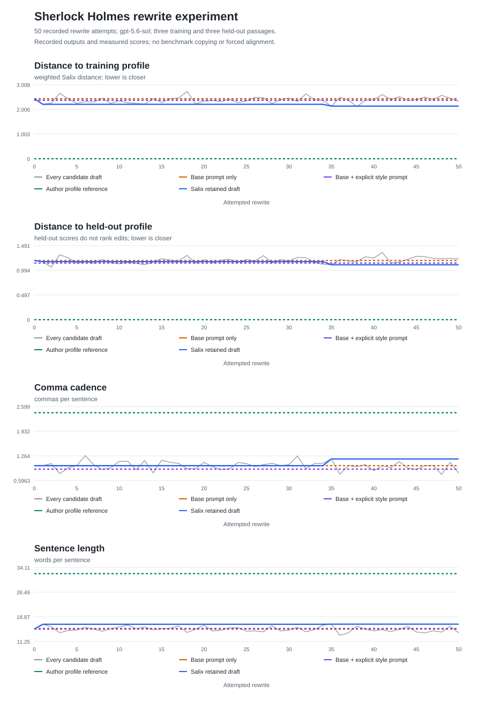

# Salix

**Writing that sounds like you.**

A personal writing skill for Claude Code and Codex. Give it examples of your
writing, then ask for a draft in your voice. Salix measures the differences;
your assistant makes the edits. No account, API key, or required Python packages.

[Install](#install) | [Use](#use) | [Examples](#examples) | [Measurements](#measurements) | [Docs](#docs)

---

## Install

Paste this into Terminal. Requires **Python 3.9+**, macOS or Linux.

```bash
curl -fsSL https://raw.githubusercontent.com/thekozugroup/Salix/main/install.sh | bash
```

Open a new agent session, then ask:

```text
Build my Salix profile from these writing samples.
```

The installer copies a self-contained skill for both agents. No Git checkout
needs to stay on your computer. Run it again to update; your profiles stay separate.
For agent-managed installation, use the prompt below. For native plugins,
project-only installs, removal, or troubleshooting, see [installation](docs/INSTALL.md).

### Copy/paste agent install prompt

```text
Install Salix from https://github.com/thekozugroup/Salix as a personal
skill for my installed Codex and/or Claude Code. Read the repository's
install.sh and installation docs first. Check for Python 3.9+.
Run install.sh with --codex or --claude if only one agent is installed.
Do not use --force without asking if an existing skill is unmanaged.
Run the installed salix CLI with `doctor --json` and `status --json`
from my project directory. Report the install paths and check results.
Keep my writing samples and profiles private. Do not change my documents,
host settings, or enable hooks. Ask me for writing samples to build a profile.
```

### Claude App

Download [**Salix.zip**](https://github.com/thekozugroup/Salix/releases/latest/download/Salix.zip)
or [**Salix.skill**](https://github.com/thekozugroup/Salix/releases/latest/download/Salix.skill).
Upload through Claude's Skills settings and enable it. Prefer `.zip` if the
file picker rejects `.skill`; both contain the same skill folder.
Release assets are published on tagged releases, not every main-branch update.

## Use

| Agent | Trigger |
| --- | --- |
| Codex | `$salix make this draft sound like me` |
| Claude Code skill | `/salix make this draft sound like me` |
| Claude Code plugin | `/salix:salix make this draft sound like me` |
| Natural language | `Learn my writing style from these samples` |

Start with several representative `.txt` or `.md` documents. The default minimum
is 300 words per file. More varied samples give a better estimate of your voice.

- **Personal voice:** one global profile across projects, stored in `~/.salix/`.
- **Project voice:** a separate client, team, or publication profile in `.salix/`.
- **Safe rewrites:** preserve the source, facts, citations, and code. Stop when
  safe improvements run out, even if the score has not reached its target.
- **Optional hooks:** native plugins can remind your agent about available
  profiles at session start. Disabled by default; they never rewrite documents.

Ask your agent: `Use my global voice` or `Build a style profile for this project`.
Auto uses a project store first. If the requested profile exists only globally,
it uses that same named global profile and reports the selected store.

Direct CLI setup from a checkout:

```bash
./salix setup --scope global --samples ~/Documents/writing --name default
./salix setup --scope project --samples ./writing --name client
./salix compare draft.md --profile client --scope project --json
./salix doctor --json
```

## Examples

Prompt: **Write a 400-550-word Watson case note about Clara Bell's missing return
ticket, her 6:40 Euston train, and a dry folded-newspaper clue. No theft or culprit.**

These are opening paragraphs from real outputs in one recorded Codex experiment.
All conditions use `gpt-5.6-sol` with low reasoning effort. The third condition
uses a Salix measurement-feedback harness, not automatic host skill selection.

| Base prompt only | Base + "write in the style of Arthur Conan Doyle's Sherlock Holmes stories" | Base + Salix feedback |
| --- | --- | --- |
| It was shortly after five o’clock on a wet November evening when Miss Clara Bell was shown into our sitting-room at Baker Street. The rain beat steadily against the panes, and our visitor, though protected by a dark cloak, carried upon her hat and shoulders the unmistakable traces of the storm. | It was upon a wet evening in October, when the rain beat fitfully against the windows of our sitting-room in Baker Street, that Mrs Hudson ushered in a young lady whose agitation was scarcely concealed by her composed manner. She gave her name as Clara Bell, and from the drops upon her cloak and the damp curls at her temples it was plain that she had come to us through the storm. | Among the minor problems submitted to Sherlock Holmes, I recall none which better displayed the value of exact observation than the curious affair of Miss Clara Bell’s return railway ticket. No crime had been committed, no dishonest hand was concerned, and the whole mystery might have passed as a commonplace misadventure. Yet one small circumstance, visible to us all, led Holmes directly to the truth. |

[Full generated texts and exact prompt](examples/live_comparison.md).

### Recorded Measurements

**50 actual rewrite attempts; 51 measured states; two retained improvements.**
Three public-domain Doyle passages train the profile; three separate passages
supply held-out scores. Grey shows every candidate, including rejected drafts.
Blue retains an eligible training-score improvement. Both prompt baselines and
the author-profile reference remain visible in every graph.

| Condition | Training Distance | Held-Out Distance |
| --- | ---: | ---: |
| Base prompt only | 2.4416 | 1.1912 |
| Base + explicit style prompt | 2.3801 | 1.1403 |
| Base + Salix feedback, retained draft | 2.1400 | 1.1057 |

Lower is closer, **not a percentage voice match**. This run improves then
plateaus; it does not achieve full benchmark alignment or prove better prose.
Watson/Baker Street already cue Doyle, and narrative training excerpts differ
from dialogue-heavy case notes. Mechanical checks are not semantic validation.
Independent reading found preserved fixed facts but overconfident causal reasoning.



[All 101 variable charts](examples/live_convergence_charts/README.md) |
[Exact texts, prompts, hashes, and data](examples/live_convergence.json) |
[Method, checks, and limitations](docs/BENCHMARK.md)

Verify offline with
`python3 scripts/live_convergence.py --validate examples/live_convergence.json`.
The earlier benchmark-copy fixture remains a labeled
[diagnostic archive](examples/README.md), not AI convergence evidence.

## Social References

Build source-linked social-post libraries and separate author profiles without
mixing comments, summaries, or shared repost bodies into an author's writing.
Keep factual review and publication approval separate from stylistic similarity.
See [social records and commands](references/social.md).

```bash
./salix social ingest records.json --out-dir references-library --metrics-only
./salix social profile references-library --out profiles.json
./salix social compare profiles.json --out chart-data.json
./salix social review draft.md --policy review-policy.json --out review.json
```

## Measurements

Sentence rhythm, vocabulary, punctuation, readability, function-word patterns,
paragraph structure, and tone. Optional spaCy improves grammatical features.
Lower distance means closer measured features, **not a percentage voice match**.
Some features depend on subject matter and document length.

The assistant writes; Salix measures. The rule-based simulator is a diagnostic
tool, not the assistant rewrite engine. See [methodology](docs/TECHNICAL.md) for
feature details, validation limits, and reproducible checks.

## Docs

- [Installation and native plugins](docs/INSTALL.md)
- [Profiles, rewrites, and troubleshooting](docs/USAGE.md)
- [Metrics, tests, and performance](docs/TECHNICAL.md)
- [Recorded writing experiment](docs/BENCHMARK.md)
- [Examples and chart archive](examples/README.md)
- [Changelog](CHANGELOG.md)

Build local release assets with
`python3 scripts/build_skill_bundle.py --release`: **Salix.skill**, **Salix.zip**,
**Salix-plugin.zip**, and **SHA256SUMS** in `dist/`. Add `--all` for the
self-contained Codex/Claude plugin directories and separate host ZIPs.

[MIT License](LICENSE)
