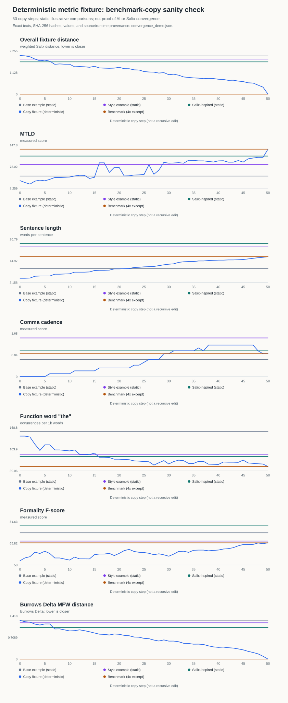

# Salix

**Writing that sounds like you.**

A personal writing skill for Claude Code and Codex. Give it examples of your
writing, then ask for a draft in your voice. Salix measures the differences;
your assistant makes the edits. No account, API key, or required Python packages.

[Install](#install) | [Use](#use) | [Examples](#examples) | [Measurements](#measurements) | [Docs](#docs)

---

## Install

Paste this into Terminal. Requires **Python 3.9+**, macOS or Linux.

```bash
curl -fsSL https://raw.githubusercontent.com/thekozugroup/Salix/main/install.sh | bash
```

Open a new agent session, then ask:

```text
Build my Salix profile from these writing samples.
```

The installer copies a self-contained skill for both agents. No Git checkout
needs to stay on your computer. Run it again to update; your profiles stay separate.
For agent-managed installation, use the prompt below. For native plugins,
project-only installs, removal, or troubleshooting, see [installation](docs/INSTALL.md).

### Copy/paste agent install prompt

```text
Install Salix from https://github.com/thekozugroup/Salix as a personal
skill for my installed Codex and/or Claude Code. Read the repository's
install.sh and installation docs first. Check for Python 3.9+.
Run install.sh with --codex or --claude if only one agent is installed.
Do not use --force without asking if an existing skill is unmanaged.
Run the installed salix CLI with `doctor --json` and `status --json`
from my project directory. Report the install paths and check results.
Keep my writing samples and profiles private. Do not change my documents,
host settings, or enable hooks. Ask me for writing samples to build a profile.
```

### Claude App

Download **Salix.zip** or **Salix.skill** from
[Releases](https://github.com/thekozugroup/Salix/releases).
Upload through Claude's Skills settings and enable it. Prefer `.zip` if the
file picker rejects `.skill`; both contain the same skill folder.
Release assets are published on tagged releases, not every main-branch update.

## Use

| Agent | Trigger |
| --- | --- |
| Codex | `$salix make this draft sound like me` |
| Claude Code skill | `/salix make this draft sound like me` |
| Claude Code plugin | `/salix:salix make this draft sound like me` |
| Natural language | `Learn my writing style from these samples` |

Start with several representative `.txt` or `.md` documents. The default minimum
is 300 words per file. More varied samples give a better estimate of your voice.

- **Personal voice:** one global profile across projects, stored in `~/.salix/`.
- **Project voice:** a separate client, team, or publication profile in `.salix/`.
- **Safe rewrites:** preserve the source, facts, citations, and code. Stop when
  safe improvements run out, even if the score has not reached its target.
- **Optional hooks:** native plugins can remind your agent about available
  profiles at session start. Disabled by default; they never rewrite documents.

Ask your agent: `Use my global voice` or `Build a style profile for this project`.
Auto uses a project store first. If the requested profile exists only globally,
it uses that same named global profile and reports the selected store.

Direct CLI setup from a checkout:

```bash
./salix setup --scope global --samples ~/Documents/writing --name default
./salix setup --scope project --samples ./writing --name client
./salix compare draft.md --profile client --scope project --json
./salix doctor --json
```

## Examples

Prompt: **Write a short Baker Street case note about a missing railway ticket.**

These are static illustrations, not recorded model outputs or a product test.

| Base prompt only | Prompt plus "write in the style of Sherlock Holmes" | Base prompt plus Salix |
| --- | --- | --- |
| Holmes received a note about a missing railway ticket. He checked the details, compared the times, and realized the ticket had never been stolen. The answer was hidden in the passenger's route. | In the dim light of Baker Street, Holmes turned the railway ticket between his long fingers and gave one of those thin smiles which usually meant the matter had already resolved itself in his mind. The missing object, he said, was never truly missing at all. | To Sherlock Holmes the missing railway ticket was not a trifle, but a small fact misplaced among larger ones. I have seldom seen him regard so slight a paper with such cold attention, for in his eyes the little oblong of pasteboard eclipsed the whole confusion of the case. |

### Metric Fixture

The overview below shows seven important measurements over **50 constructed
steps**, with the three examples as static comparison lines. Values are measured
from stored texts, not invented. **This is not evidence of an AI rewrite
converging:** the changing fixture copies more benchmark text at each step and
ends with the exact training excerpt. Zero distance therefore proves only the
metric's self-comparison check. It does not prove writing quality or voice fidelity.



[All variable charts](examples/convergence_charts/README.md) |
[Texts, hashes, and measurement data](examples/convergence_demo.json) |
[Method and limitations](examples/README.md)

The excerpt is attributed to
[The Adventures of Sherlock Holmes](https://www.gutenberg.org/ebooks/1661).
Regenerate with `python3 scripts/demo_convergence.py`. A real held-out,
meaning-preserving model rewrite experiment remains necessary before making
product convergence claims.

## Social References

Build source-linked social-post libraries and separate author profiles without
mixing comments, summaries, or shared repost bodies into an author's writing.
Keep factual review and publication approval separate from stylistic similarity.
See [social records and commands](references/social.md).

```bash
./salix social ingest records.json --out-dir references-library --metrics-only
./salix social profile references-library --out profiles.json
./salix social compare profiles.json --out chart-data.json
./salix social review draft.md --policy review-policy.json --out review.json
```

## Measurements

Sentence rhythm, vocabulary, punctuation, readability, function-word patterns,
paragraph structure, and tone. Optional spaCy improves grammatical features.
Lower distance means closer measured features, **not a percentage voice match**.
Some features depend on subject matter and document length.

The assistant writes; Salix measures. The rule-based simulator is a diagnostic
tool, not the assistant rewrite engine. See [methodology](docs/TECHNICAL.md) for
feature details, validation limits, and reproducible checks.

## Docs

- [Installation and native plugins](docs/INSTALL.md)
- [Profiles, rewrites, and troubleshooting](docs/USAGE.md)
- [Metrics, tests, and performance](docs/TECHNICAL.md)
- [Examples and chart archive](examples/README.md)
- [Changelog](CHANGELOG.md)

Build local release assets with
`python3 scripts/build_skill_bundle.py --release`: **Salix.skill**, **Salix.zip**,
**Salix-plugin.zip**, and **SHA256SUMS** in `dist/`. Add `--all` for the
self-contained Codex/Claude plugin directories and separate host ZIPs.

[MIT License](LICENSE)
